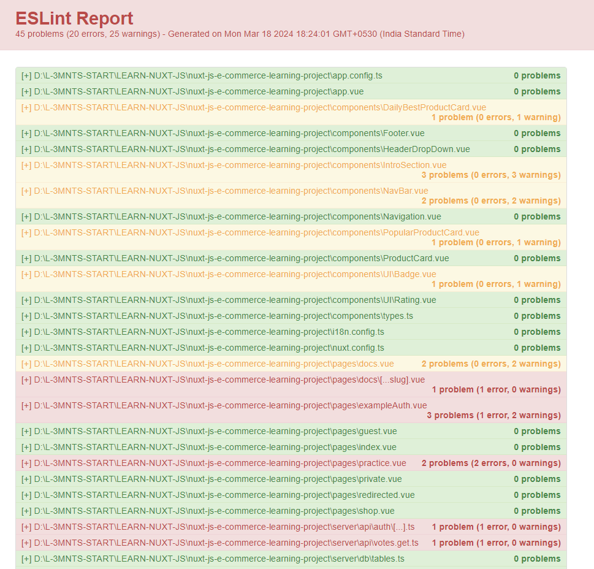

## Shareable ESLint Configurations for TypeScript

### Overview

This documentation provides developers with a step-by-step guide on integrating shareable ESLint configuration `eslint-config-js-ts` for javascript and typescript rules in any front-end project. ESLint is a static code analysis tool for identifying and fixing common programming errors and enforcing coding standards.

> <br/>
>
> ### The project is built and maintained by [Covalience India Pvt Ltd.](https://covalience.com/)
>
> <br />

#### Installation

Install dev dependencies:

```
 npm install --save-dev eslint@8.56.0 typescript git+https://github.com/CovalienceGithub/eslint-config-js-ts.git @typescript-eslint/parser@^6.21.0 @typescript-eslint/eslint-plugin@^6.21.0
```

#### Dependencies

Please ensure that you have the following dependencies in your project:

```
    "@typescript-eslint/eslint-plugin": "^6.21.0",
    "@typescript-eslint/parser": "^6.21.0",
    "typescript": "^5.3.3",
    "eslint": "^8.56.0",
```

### Usage

Once the `eslint-config-js-ts` package is installed, you can use by specifying `js-ts` in the [`extends`](http://eslint.org/docs/user-guide/configuring#extending-configuration-files) section in your ESLint configuration.

1. Update **.eslintrc.{js,yml,json,cjs}** with the following:

```diff
extends:[
- 'eslint:recommended',
- 'plugin:@typescript-eslint/recommended',
+ 'eslint-config-js-ts'
],
parserOptions:{
+ project:['./tsconfig.json']
// you can add more typescript config files here if you have more than one
}

```

2. Update your typescript configuration file **tsconfig.json** with the following:

```diff
+ "strictNullChecks":true
```

### ESLint Formatter (Optional)

ESLint comes with several built-in formatters to control the appearance of the linting results, and supports third-party formatters as well.
For more details, please refer to [here](https://eslint.org/docs/latest/use/formatters/).

Following are the steps to setup `html` eslint formatter.

1. Update `package.json` file with the following:

```diff
   scripts:{
+ "lint:format":"eslint . --format=html --output-file=eslintReport.html"
   }
```

2. Run `npm run lint:format` in the terminal. This will generate a HTML file named `eslintReport.html` at the root directory of your project and while opening it, it will show all eslint errors and warnings found.

_Example of ESLint Report in HTML:_



#### Additional Documentation

- [CHANGELOG](CHANGELOG.md)
- [Javascript Style Guide](./docs/JavaScriptStyleGuide.md)
- [Typescript Style Guide](./docs/TypeScriptStyleGuide.md)

### FAQ

#### I get this error when running ESLint: "The file must be included in at least one of the projects provided"

This means you are attempting to lint a file that `tsconfig.json` doesn't include.

A common fix is to create a `tsconfig.eslint.json` file, which extends your `tsconfig.json` file and includes all files you are linting.

```json
{
  "extends": "./tsconfig.json",
  "include": ["src/**/*.ts", "src/**/*.js", "test/**/*.ts"]
}
```

Update your ESLint config file:

```diff
parserOptions: {
-  project: './tsconfig.json',
+  project: './tsconfig.eslint.json',
}
```

### Why do I need the peer dependencies?

`@typescript-eslint/eslint-plugin` is a peer dependency due to a limitation within ESLint. See [issue](https://github.com/eslint/eslint/issues/3458), [RFC](https://github.com/eslint/rfcs/tree/master/designs/2019-config-simplification), and [progress](https://github.com/eslint/eslint/issues/13481).

`@typescript-eslint/parser` is a peer dependency because the version number must match `@typescript-eslint/eslint-plugin`.

<br/>
<br/>
<br/>
